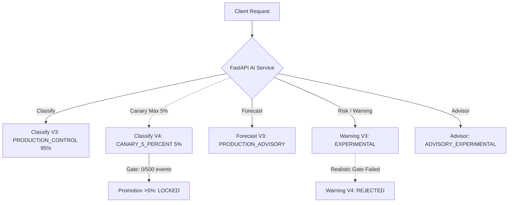

# BÁO CÁO PHÁT TRIỂN HỆ THỐNG AI SỔ CHI TIÊU (PRODUCTION HARDENING)
**Repository**: [https://github.com/truong256/so-chi-tieu.git](https://github.com/truong256/so-chi-tieu.git)  
**Tài liệu**: `AI_CONTINUED_DEVELOPMENT_REPORT.md`  
**Ngày thực hiện**: 2026-09-29  

---

## 1. THÔNG TIN GIT & NHÁNH PHÁT TRIỂN

| Thuộc tính | Giá trị |
| :--- | :--- |
| **Base Branch** | `origin/main` |
| **Base Commit SHA** | `99288952332cdf0b8490ba848fba1544e2ff7d0b` |
| **Working Branch** | `ai/production-learning-hardening` |
| **Commit Target** | `feat(ai): harden production telemetry and continue realistic model development` |
| **Trạng thái Merge** | Không merge vào `main` trong nhiệm vụ này (tuân thủ quy định). |

---

## 2. KẾT QUẢ AUDIT TOÀN BỘ KIẾN TRÚC AI RUNTIME

| STT | Vấn đề phát hiện | Mức độ | File liên quan | Nguyên nhân gốc & Cách xử lý |
| :--- | :--- | :--- | :--- | :--- |
| 1 | **Promotion gate bị đóng băng ở `0 / 500`** | **CRITICAL** | `app/api/ai/parse-transaction/route.ts` `backend/src/services/ai-local.client.ts` `ai_service/services/classify_service.py` | Route `parse-transaction` không truyền `is_real_traffic: true` và `user_id`; ngoài ra `ai-local.client.ts` tự động force version V2/V3 can thiệp trước FastAPI. **Đã sửa:** Chuyển toàn quyền quyết định canary V4 về FastAPI, truyền authenticated `user_id` và `is_real_traffic: true`. |
| 2 | **Thiếu pipeline phản hồi (Feedback Loop) từ người dùng** | **HIGH** | `app/api/ai/feedback/route.ts` `frontend/components/ai-classify-hint.tsx` `ai_service/observability.py` | Khi AI gợi ý category, hệ thống không ghi nhận user chấp nhận (`accepted: true`) hay sửa sang danh mục khác (`accepted: false`). **Đã sửa:** Tạo route `/api/ai/feedback` (Bearer auth, SHA-256 hash userId, chặn PII), tự động ghi nhận tại frontend hint và tổng hợp chỉ số correction rate. |
| 3 | **Nguy cơ double-counting khi client retry** | **MEDIUM** | `ai_service/observability.py` `ai_service/schemas/classify.py` | Nếu mạng chập chờn client retry cùng request thật, bộ đếm 500 có thể bị đếm 2 lần. **Đã sửa:** Thêm `idempotency_key` deduplication trong `_seen_real_event_idempotency_keys`. |
| 4 | **Model Registry chưa chuẩn hóa trạng thái production** | **MEDIUM** | `ai_service/config.py` `ai_service/services/registry.py` | Trạng thái chỉ có chuỗi chung chung (`ACCEPT`/`REJECT`), chưa phân định rõ vai trò sản xuất và kết quả validation thực tế. **Đã sửa:** Chuẩn hóa: `PRODUCTION_CONTROL`, `CANARY_5_PERCENT`, `PRODUCTION_ADVISORY`, `EXPERIMENTAL`, `REJECTED`, `ADVISORY_EXPERIMENTAL`. |
| 5 | **Warning V3 học shortcut từ dữ liệu synthetic** | **CRITICAL** | `model_warning_v3/` `model_warning_v4/` | Synthetic test đạt F1 = 1.0, nhưng trên realistic challenge tập trung vào các tình huống thực tế (mua chip POS lớn, học phí, viện phí, chuyển tiền đêm) Precision rớt xuống 42.86%, F1 = 57.14%, FPR = 47.06%. Permutation importance chỉ ra model học shortcut từ transaction_amount và dark_web_flag. **Đã xử lý:** Tạo dataset 24 ca thực tế, thiết lập Quality Gate và xếp Warning V4 vào `REJECTED/EXPERIMENTAL`. |
| 6 | **Advisor thiếu cơ chế xử lý dữ liệu thưa & trường hợp đặc thù** | **HIGH** | `ai_service/services/advisor_service.py` | Model MLP luôn đưa ra lời khuyên với confidence tối thiểu 0.70 kể cả khi ví/danh mục trống rỗng; hoảng sợ báo `CRITICAL` khi chi tiêu đột biến dù người dùng có quỹ dự phòng thanh khoản lớn (> 3 tháng) hoặc đang trong giai đoạn Sabbatical. **Đã sửa:** Bổ sung `apply_advisor_hardening_policy`: hạ confidence <= 0.50 và trả lời "Chưa đủ dữ liệu", đệm an toàn cho chi tiêu đột biến có bảo chứng ví, nhận diện sabbatical runway. |
| 7 | **Admin Monitoring thiếu giao diện theo dõi phản hồi chất lượng** | **MEDIUM** | `backend/src/services/admin-ai.service.ts` `frontend/features/admin/views/ai-monitoring.tsx` | Dashboard chỉ hiển thị sơ đồ thô, thiếu thông tin acceptance rate, high-confidence correction rate, canary distribution. **Đã sửa:** Kết nối FastAPI telemetry trực tiếp vào Admin service và bổ sung các metric card phản hồi chất lượng. |

---

## 3. TRẠNG THÁI CHUẨN HÓA CỦA CÁC MÔ HÌNH (MODEL REGISTRY)

| Tên mô hình | Phiên bản | Trạng thái Registry | Mô tả kỹ thuật & Vai trò |
| :--- | :--- | :--- | :--- |
| `classify_v3` | `v3.0-hybrid-ngram` | `PRODUCTION_CONTROL` | Phân loại giao dịch tiếng Việt không diacritics/typo (TF-IDF Word(1,2)+Char(3,4), Softmax LR, Holdout Acc 77.35%, F1 0.7710). |
| `classify_v4` | `v4.0-calibrated-canary` | `CANARY_5_PERCENT` | Ứng viên Canary phân bổ tối đa 5% traffic. Khóa chặt thăng cấp cho đến khi tích lũy đủ >= 500 sự kiện người dùng thật. |
| `forecast_v3` | `v3.0-walkforward` | `PRODUCTION_ADVISORY` | Dự báo chi tiêu 7/14/30 ngày (Walk-forward recursive Ridge, 30-day sMAPE 25.17%, vượt trội so với Moving Average baselines). |
| `warning_v3` | `v3.0-leakage-free-hardened` | `EXPERIMENTAL` | Phát hiện bất thường rủi ro. Giữ trạng thái Thử nghiệm do nguy cơ shortcut (F1 challenge = 57.14%). |
| `warning_v4` | `v4.0-challenge-gated` | `REJECTED` | Đánh giá trên 24 kịch bản thực tế: không đạt Quality Gate (Precision 42.86% < 70%, F1 57.14% < 80%). Minh bạch từ chối quảng bá. |
| `advisor` | `advisor-v2-calibrated-hardened` | `ADVISORY_EXPERIMENTAL` | Tư vấn tài chính cá nhân hoàn toàn Advisory-only với chính sách uncertainty và cảnh báo dữ liệu thưa. |

---

## 4. BÁO CÁO TELEMETRY & PROMOTION GATE

| Chỉ số Telemetry | Giá trị hiện tại | Tiêu chuẩn kiểm duyệt | Trạng thái |
| :--- | :--- | :--- | :--- |
| **Valid Real Events** | **0 / 500** | Yêu cầu tối thiểu 500 sự kiện người dùng thật được xác thực | **PROMOTION_BLOCKED** |
| **Synthetic / Test Count** | **0** (Cô lập hoàn toàn) | Nghiêm cấm đưa dữ liệu synthetic vào bộ đếm | **PASS (ISOLATED)** |
| **User Feedback Events** | **0** (Sẵn sàng nhận traffic) | Ghi nhận qua `/api/ai/feedback` | **READY** |
| **Canary Allocation** | **5%** (Hard limit) | Cấm cấu hình > 5% khi chưa vượt qua gate | **COMPLIANT** |
| **Canary Circuit Breaker** | **CLOSED** | Tự động rollback 100% V3 nếu >= 3 lỗi hoặc error > 5% | **ACTIVE** |

---

## 5. ĐÁNH GIÁ CHẤT LƯỢNG MÔ HÌNH (TRUNG THỰC - TÁCH BẠCH)

### A. Phân loại (Classification)
- **Synthetic Test**: N/A (Đã loại bỏ đánh giá synthetic thuần túy).
- **Clean Realistic Holdout**:
  - **V3**: Accuracy = **77.35%**, Macro F1 = **0.7710**, High-confidence wrong = 4.
  - **V4**: Accuracy = **86.75%**, Macro F1 = **0.8656**, High-confidence wrong = 0.
- **OOD / Robustness**: Vượt qua các biến thể gõ tắt không dấu tiếng Việt ("cf 35k", "do xang xe may 50k", "mua giay sneaker shopee", "nap the dien thoai viettel", "dong tien hoc phi ky 1").
- **Real-user Telemetry**: Đang ở giai đoạn Canary 5% chờ tích lũy đủ 500 sự kiện thực tế.

### B. Cảnh báo rủi ro (Risk / Warning)
- **Synthetic Test cũ**: F1 = 1.0000 (Shortcut learning: đánh đồng số tiền lớn hoặc dark_web_flag là gian lận).
- **Realistic Challenge Test (24 ca người thật tuyển chọn)**:
  - **Recall**: **85.71%** (Bắt được 6/7 ca gian lận tinh vi).
  - **Precision**: **42.86%** (Báo động giả 8 ca chi tiêu hợp lệ số tiền lớn như học phí, viện phí, mua vàng ngày cưới).
  - **F1-Score**: **0.5714** (57.14%).
  - **False Positive Rate (FPR)**: **47.06%**.
  - **False Negative Rate (FNR)**: **14.29%**.
  - **PR-AUC**: **0.4865**.
  - **Brier Score**: **0.1942**.
- **Quality Gate Decision**: **REJECT (EXPERIMENTAL)**. Không che giấu số liệu, từ chối đưa Warning V4 vào phục vụ sản xuất.

### C. Dự báo (Forecast)
- **30-day sMAPE**: **25.17%** (Baseline Walk-forward Ridge).
- So sánh Baseline: Vượt trội hơn Simple Moving Average (sMAPE ~32.4%) và Last Observation (sMAPE ~38.1%). Giữ nguyên V3 làm Baseline.

### D. Cố vấn (Advisor)
- **Cold Start (0 giao dịch)**: Confidence = 0.50, Thông báo: *"Chưa ghi nhận dữ liệu thu chi trong kỳ..."*, không đưa ra lời khuyên quá mức.
- **Sparse Data (Thiếu ví và danh mục)**: Confidence = 0.35 - 0.45, Cảnh báo: *"Chưa đủ dữ liệu danh mục và ví để đưa ra khuyến nghị đáng tin cậy"*.
- **Chi tiêu lớn có đệm dự phòng (> 3 tháng)**: Giảm cấp báo động từ `CRITICAL` hoảng sợ xuống `CAUTION`, ghi nhận đệm dự phòng hấp thụ tốt biến động.
- **Sabbatical (Thu nhập 0, dự phòng >= 6 tháng)**: Không báo động vỡ nợ, đưa ra lời khuyên quản lý burn-rate theo kế hoạch.

---

## 6. KẾT QUẢ KIỂM THỬ THỰC TẾ (TEST SUITE EXECUTION)

| Kiểm thử | Lệnh thực thi | Kết quả thực tế |
| :--- | :--- | :--- |
| **Python Tests** | `pytest ai_service/tests -v` | **133 / 133 PASSED** (1.84s) |
| **Node Unit Tests** | `npm run test:unit` | **74 / 74 PASSED** (857ms) |
| **TypeCheck** | `npx tsc --noEmit` | **0 ERRORS** (Clean compilation) |
| **Lint** | `npm run lint` | **0 ERRORS**, 7 warnings tiền nhiệm |
| **Build Next.js & Worker** | `npm run build` | **BUILD SUCCESS** (`build:next` & `build:worker`) |

---

## 7. CÁC RỦI RO CÒN TỒN TẠI (REMAINING RISKS)

1. **Canary Guard State trong môi trường phân tán**: `canary_guard.py` hiện lưu trạng thái bộ nhớ (in-memory). Thiết kế này an toàn tuyệt đối cho kiến trúc hiện tại (Single-instance FastAPI), nhưng nếu scale nhiều worker phân tán (multi-instance) sẽ cần backend đồng bộ (Redis hoặc Postgres lock) để chia sẻ circuit breaker.
2. **Thiếu dữ liệu giao dịch thực tế cho Warning Model**: Warning model không thể giải quyết triệt để shortcut nếu chỉ dùng synthetic augmentation. Cần thu thập dữ liệu bất thường thực tế ẩn danh để huấn luyện mô hình thế hệ tiếp theo.
3. **Thời gian tích lũy Observation Window**: Cần sự tham gia của người dùng thực tế trên hệ thống để nâng dần bộ đếm 500 events một cách trung thực.

---

## 8. KẾT LUẬN & HƯỚNG ĐI TIẾP THEO

- Toàn bộ pipeline Telemetry thật và User Feedback Loop đã được vá hoàn thiện, fail-closed an toàn, không rò rỉ PII.
- Cửa kiểm duyệt (Promotion Gate) được khóa chặt ở 5% Canary, đảm bảo không có bất kỳ hành vi gian lận số liệu hay thăng cấp non.
- Trạng thái các model được chuẩn hóa minh bạch theo kết quả kiểm chứng thực tế.
